# Jumeau numérique — soudage par induction de composites CF/PEKK

Un **jumeau numérique** (simulation Python) du **soudage par induction** de laminés
composites carbone/PEKK. À partir de la géométrie du montage et du courant de la bobine,
le modèle prédit **où et à quelle vitesse la matière chauffe** à l'interface de soudure —
une carte de température 3D dans le temps — puis la confronte aux **thermocouples** des
essais réels (maîtrise, LIPEC/ÉTS).

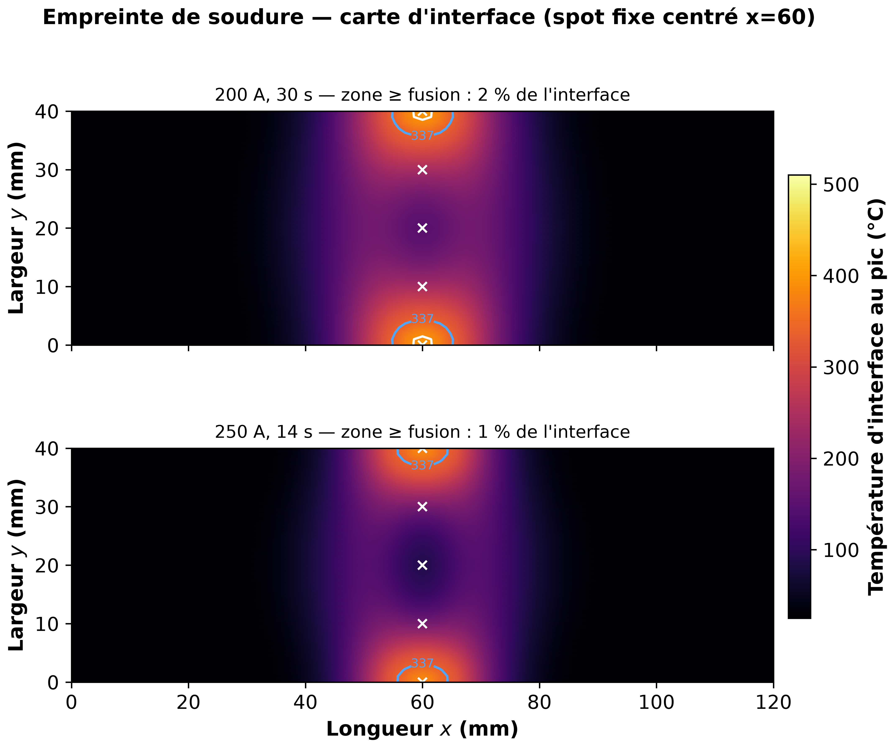

> *Ce que produit le jumeau : la carte de température à l'interface sous l'empreinte de
> chauffe, à la manière de Lionetto et al. 2017 (Fig. 4). Les deux lobes chauds vers les
> bords libres et le creux central forment le « profil en M » caractéristique — expliqué
> plus bas.*

---

## Sommaire

1. [Le problème : souder des composites par induction](#1-le-problème--souder-des-composites-par-induction)
2. [Vue d'ensemble du modèle](#2-vue-densemble-du-modèle)
3. [La physique, équation par équation](#3-la-physique-équation-par-équation)
4. [Les expériences (et pourquoi on les a faites)](#4-les-expériences-et-pourquoi-on-les-a-faites)
5. [Validation](#5-validation)
6. [Hypothèses et limites connues](#6-hypothèses-et-limites-connues)
7. [Utilisation](#7-utilisation)
8. [Structure du dépôt](#8-structure-du-dépôt)
9. [Sources, citation et licence](#9-sources-citation-et-licence)

---

## 1. Le problème : souder des composites par induction

Les composites **carbone/PEKK** (fibres de carbone dans une matrice thermoplastique PEKK)
se soudent en **fondant localement la matrice** à l'interface entre deux pièces, sous
pression. Pour chauffer *sans contact*, on place au-dessus du joint une **bobine à induction**
(un tube de cuivre en épingle, « hairpin ») parcourue par un courant alternatif haute
fréquence (**388 kHz**). Ce courant crée un champ magnétique oscillant qui **induit des
courants de Foucault** dans les fibres de carbone conductrices : ceux-ci dissipent de la
chaleur par **effet Joule**, exactement là où on veut fondre.

Un **concentrateur de flux magnétique** (MFC, *Magnetic Flux Concentrator* — ici un bloc
Fluxtrol Ferrotron 559H) canalise le champ vers une empreinte étroite. Un pli **twill**
(tissu de carbone sergé, 0,20 mm) placé à l'interface sert de **suscepteur** : très
conducteur, il concentre la dissipation au bon plan.

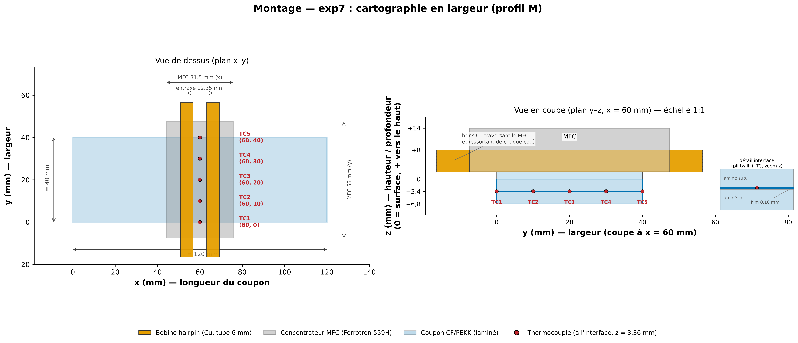

> *Le montage semi-statique : coupon CF/PEKK **120 × 40 mm**, concentrateur MFC
> **31,5 × 55 mm**, bobine hairpin en tube Cu **6 × 6 mm** (entraxe des brins 12,35 mm),
> interface de soudure à **z = 3,36 mm**. Les 5 thermocouples (points rouges) mesurent la
> température à l'interface en travers de la largeur.*

**Pourquoi un jumeau numérique ?** Régler ce procédé à l'aveugle est coûteux : la fenêtre
entre « pas assez chaud pour souder » et « trop chaud, on dégrade le PEKK » est étroite, et
la répartition de chaleur dépend finement de la géométrie. Le jumeau permet de **prédire la
carte thermique** pour un courant donné, d'**expliquer** les gradients observés, et de
préparer les réglages avant de lancer une manip.

---

## 2. Vue d'ensemble du modèle

Le calcul enchaîne quatre étages physiques, du champ électromagnétique jusqu'à la
température, plus une étape de calibration :

```
Courant bobine (388 kHz)
      │
      ▼
① Champ magnétique  Bz(x,y)         ── Biot-Savart + images du MFC
      │
      ▼
② Courants de Foucault  ψ, J(x,y)   ── plaque mince (Lin 1993), par couche
      │
      ▼
③ Source de chaleur  q(x,y,z)       ── effet Joule  q = |J|²/σ
      │
      ▼
④ Diffusion thermique  T(x,y,z,t)   ── équation de la chaleur transitoire + fusion
      │
      ▼
⑤ Calibration / validation          ── contre les thermocouples mesurés
```

Chaque étage est détaillé ci-dessous avec son équation.

---

## 3. La physique, équation par équation

### 3.1 Le champ magnétique (loi de Biot-Savart)

La bobine hairpin est modélisée par une **polyligne de segments** de courant. Le champ
magnétique en un point $\mathbf{r}$ est la somme des contributions de chaque segment, via la
loi de **Biot-Savart** :

$$
\mathbf{B}(\mathbf{r}) = \frac{\mu_0 I}{4\pi} \int \frac{d\boldsymbol{\ell} \times (\mathbf{r}-\mathbf{r}')}{\lVert \mathbf{r}-\mathbf{r}' \rVert^{3}}
$$

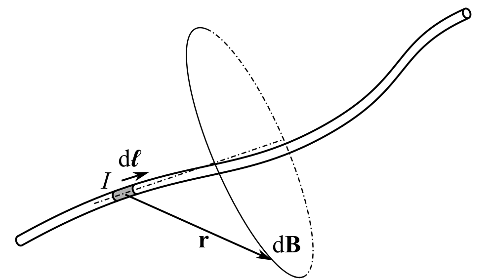

> *Géométrie de la loi de Biot-Savart : un élément de courant $I\,d\boldsymbol{\ell}$ en
> $\mathbf{r}'$ contribue au champ en $\mathbf{r}$. (Figure reproduite du dépôt **eppy** de
> W.J.B. Grouve, MIT — voir [§9](#9-sources-citation-et-licence).)*

Le **concentrateur MFC** (perméable, $\mu_r = 16$) est traité au premier ordre par la
**méthode des images** à travers un demi-espace perméable : chaque segment de la bobine est
« reflété », avec un facteur d'intensité

$$
\frac{\mu_r - 1}{\mu_r + 1} \approx 0{,}88 .
$$

Seule la composante **hors-plan** $B_z(x,y)$ compte pour la suite (elle traverse la plaque).

### 3.2 Les courants de Foucault (plaque mince, Lin 1993)

À 388 kHz, la **profondeur de peau** dans les fibres,

$$
\delta = \sqrt{\frac{2}{\mu_0\,\sigma\,\omega}} \approx 6\ \text{mm},
$$

est **plus grande que l'épaisseur du stack** (3,36 mm). Les courants sont donc **plans** : on
peut réduire le problème 3D à un problème **2D par couche conductrice** (le twill suscepteur,
et les deux laminés homogénéisés). On introduit une **fonction de courant** $\psi$ telle que

$$
\mathbf{J} = \nabla\times(\psi\,\hat{\mathbf z}), \qquad J_x = \frac{\partial\psi}{\partial y},\quad J_y = -\frac{\partial\psi}{\partial x},
$$

ce qui garantit automatiquement la conservation du courant ($\nabla\!\cdot\!\mathbf{J}=0$). En
injectant la loi d'Ohm $\mathbf{E}=\tilde\rho\,\mathbf{J}$ dans la loi de Faraday
$(\nabla\times\mathbf{E})_z = -j\omega B_z$, on obtient l'équation résolue par différences
finies (formulation **Lin 1993**, tenseur de résistivité anisotrope $\rho_{xx},\rho_{yy}$) :

$$
\frac{\partial}{\partial x}\!\left(\rho_{yy}\frac{\partial\psi}{\partial x}\right) + \frac{\partial}{\partial y}\!\left(\rho_{xx}\frac{\partial\psi}{\partial y}\right) = j\omega\,B_z ,
\qquad \psi = 0 \ \text{sur les bords.}
$$

La condition $\psi = 0$ au bord traduit un fait physique simple : **aucun courant ne peut
traverser le chant** de la plaque. Les boucles de courant induites sont donc **écrasées
contre les bords libres**, ce qui concentre la dissipation aux chants et l'annule au centre
de chaque boucle — c'est l'origine du **profil en « M »** en largeur :

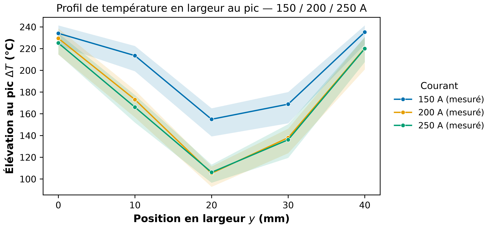

> *Conséquence directe de $\psi=0$ au bord : la température au pic dessine un « M » sur la
> largeur — chaude aux chants ($y = 0$ et $40$ mm), creuse au centre ($y = 20$ mm). Mesuré à
> 150 / 200 / 250 A.*

### 3.3 La source de chaleur (effet Joule)

La puissance dissipée par unité de volume dans chaque couche est la dissipation Joule
moyenne (courant RMS) :

$$
q = \rho_{xx} J_x^2 + \rho_{yy} J_y^2 \;=\; \frac{\lVert\mathbf{J}\rVert^2}{\sigma}\ \text{(cas isotrope)} \quad [\text{W/m}^3].
$$

Elle est déposée sur la grille thermique 3D en **conservant la puissance surfacique** de
chaque couche.

### 3.4 La diffusion thermique (équation de la chaleur transitoire)

La température $T(x,y,z,t)$ obéit à l'**équation de la chaleur** avec le terme source Joule :

$$
\rho\,c_p^{\text{app}}(T)\,\frac{\partial T}{\partial t} = \nabla\!\cdot\!\big(k\,\nabla T\big) + q .
$$

La **fusion** du PEKK est modélisée par une **capacité calorifique apparente** : un pic
gaussien ajouté à $c_p$ autour de la température de fusion, dont l'aire vaut la chaleur
latente $L_f$ :

$$
c_p^{\text{app}}(T) = c_p + L_f\,g(T),\qquad g \sim \mathcal{N}\big(T_f,\ \Delta T_f\big),
$$

avec $T_f = 337\ ^\circ\text{C}$, $\Delta T_f = 15\ ^\circ\text{C}$, $L_f = 130\ \text{kJ/kg}$.

**Conditions aux limites** : convection **et** rayonnement sur les faces libres,

$$
-k\,\partial_n T = h\,(T - T_\infty) + \varepsilon\,\sigma_{\!SB}\,(T^4 - T_\infty^4),
$$

et une **conductance de contact** vers le puits froid (céramique + concentrateur refroidi à
l'eau, ~20 °C) sous l'empreinte active. Le procédé semi-statique indexe la tête sur **4
empreintes successives** ; l'intégration temporelle utilise la **méthode des lignes** (schéma
BDF implicite, jacobien creux).

### 3.5 Calibration

La source électromagnétique est calculée à un **facteur d'échelle** près (`facteur_couplage`,
qui absorbe l'efficacité du couplage, l'incertitude sur σ et les contacts fibre-fibre — voir
[`docs/modele/facteur_couplage_decomposition.md`](docs/modele/facteur_couplage_decomposition.md)).
Ce facteur et 2-3 coefficients d'échange sont **calibrés par moindres carrés non linéaires**
(pondérés par le bruit capteur, initialisés par un plan LHS) contre **un seul essai**, puis le
modèle est **validé sur les autres essais sans recalibrage**.

---

## 4. Les expériences (et pourquoi on les a faites)

Le jumeau a été confronté à plusieurs campagnes de thermocouples. Pour chacune : *pourquoi*
on l'a faite, et ce qu'elle a montré.

### exp7 — cartographie bord→centre (le profil « M »)

*Le modèle prédit un profil en M très contrasté ; il fallait le mesurer directement pour
savoir si ce contraste est réel ou exagéré.* Cinq thermocouples en travers de la largeur
($y = 0/10/20/30/40$ mm), à 5 courants (150→250 A), avec céramique en place.

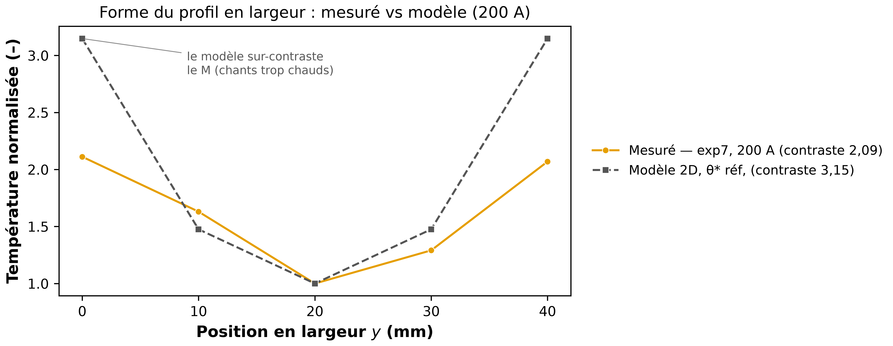

> *La **forme** du M est bien reproduite (chants chauds, centre creux), mais le modèle
> **sur-contraste** le rapport bord/centre. Ce résidu est aujourd'hui la principale limite
> connue (voir [§6](#6-hypothèses-et-limites-connues)).*

### exp9 — dissipation longitudinale (mesurer la conduction)

*Au centre de la largeur, la source est quasi nulle : la chaleur ne s'y propage que par
conduction, ce qui permet de mesurer directement l'étalement thermique dans le plan.* Une
ligne de thermocouples en longueur ($x = 0 \ldots 120$ mm) valide la décroissance
longitudinale de la source.

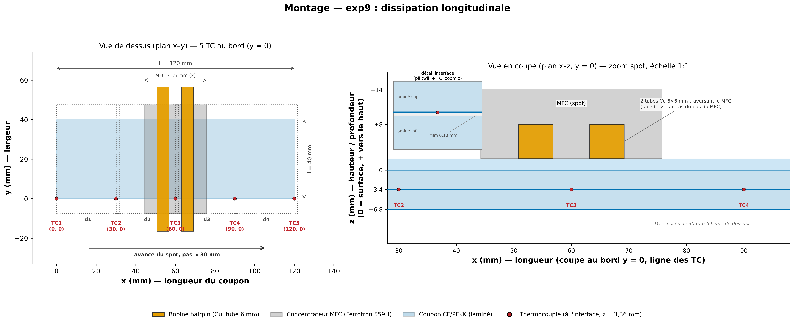

> *Montage exp9 : les 5 thermocouples sont alignés en **longueur** au bord ($y = 0$),
> $x = 0/30/60/90/120$ mm, pour suivre la propagation de la chaleur le long du joint.*

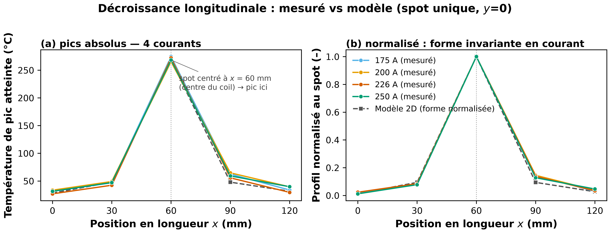

> *Décroissance de $\Delta T$ le long de la longueur pour un spot centré : la décroissance
> raide de la source en longueur est bien reproduite (phase 1, au bord). La phase au centre
> — mesure décisive de la conductivité `k_plan` — reste à faire.*

### Procédé semi-statique — 4 empreintes séquentielles

*Le vrai procédé n'est pas un point chaud statique mais une tête qui s'indexe le long du
joint ; il fallait vérifier que le modèle enchaîne correctement les passes.*

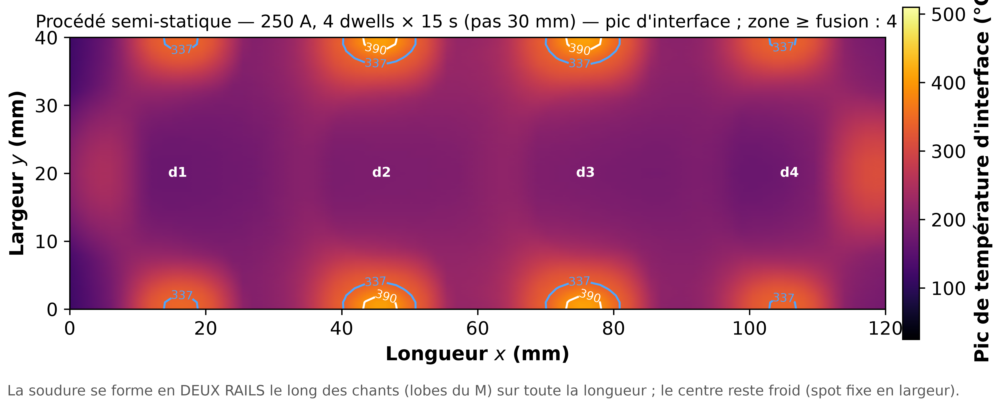

> *Un panneau par empreinte : la bobine s'arrête successivement à 4 positions, chaque passe
> réchauffant sa zone puis diffusant vers les voisines.*

### Loi en courant — du courant au taux de chauffe

*Pour piloter le procédé, on veut relier une grandeur réglable (le courant) à une grandeur
utile (la vitesse de chauffe) ; cette loi sert de base à la prédiction.*

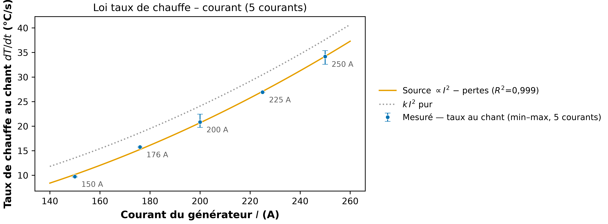

> *La puissance induite variant comme $I^2$, le taux de chauffe suit une loi en courant
> mesurée (R² = 0,999), fréquence constante 388 ± 2 kHz.*

### Fenêtre de soudage — la zone de bon procédé

*Souder demande d'être au-dessus de la fusion sans dégrader le PEKK ; tracer cette fenêtre
guide le choix courant × temps.*

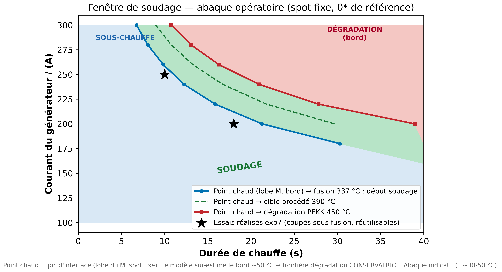

> *La zone admissible entre l'atteinte de la fusion (337 °C) et la dégradation (~450 °C), en
> fonction du courant et du temps de chauffe.*

### Vérification croisée du solveur EM (eppy)

*Avant de conclure que le M sur-contrasté est un défaut du modèle, il fallait exclure un
bug de notre solveur électromagnétique.* On a confronté notre solveur (Lin 1993, potentiel
$\psi$) à **eppy** (W.J.B. Grouve, Nagel 2019, potentiel $T$) — un **second solveur
indépendant** validé dans la littérature.

Un code indépendant, isotrope, sans MFC, **reproduit le même contraste (~3,0)** : le M
sur-contrasté est donc de la **vraie physique plaque-mince**, pas un artefact de notre
implémentation. Détails :
[`docs/modele/verification_croisee_eppy.md`](docs/modele/verification_croisee_eppy.md) ;
solveur vendoré sous [`third_party/eppy/`](third_party/eppy/).

---

## 5. Validation

Le modèle est calibré sur **un** essai puis confronté aux autres **sans recalibrage**. Il
reproduit bien la forme des profils et les taux de chauffe ; les écarts résiduels sont
documentés et tracés à un **seul défaut structurel** : un étalement de chaleur dans le plan
un peu trop lent (le M trop contrasté). Ce diagnostic a été **corroboré par un second solveur
EM indépendant** (§4) et par un audit ligne-à-ligne contre la référence Lionetto 2017
([`docs/modele/audit_lionetto_2017.md`](docs/modele/audit_lionetto_2017.md)).

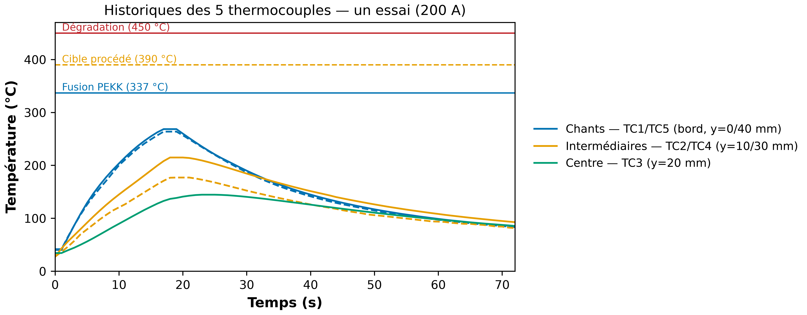

> *Exemple de données brutes : les 5 historiques température-temps d'un essai (200 A),
> groupés par symétrie de position — le type de mesure auquel le modèle est confronté.*

Paramètres de référence 2D (θ\* canonique) : `facteur_couplage = 6,0123`,
`h_haut = 30,087`, `h_bas_2d = 37,424`, `h_bord_x0 = 250` W/m²·K.

---

## 6. Hypothèses et limites connues

### Hypothèses (assumées, sourcées)

| Hypothèse | Justification |
|---|---|
| Plaque mince EM, courants plans | Lin 1993 ; $\delta \approx 6$ mm > 3,36 mm à 388 kHz |
| Champ de réaction (auto-blindage) négligé | absorbé par `facteur_couplage` ; **justifié** par la vérif eppy (réaction ≤ 0,03 % au régime twill) |
| MFC = demi-espace perméable (images) | approximation 1er ordre de la concentration de flux ($\mu_r = 16$) |
| Laminé homogénéisé ($\sigma, k$ quasi-iso plan) | O'Shaughnessey 2014 ; Grouve 2020 |
| $\mu_r = 1$ pour le laminé | Grouve 2020 (Lionetto 2017) |
| Fusion via $c_p$ apparent gaussien | notebook 1D ; Samanis et al. 2026 |
| Fréquence figée à 388 kHz | relevé machine (sinon corrélée au facteur d'échelle) |
| Bobine + MFC refroidis → puits 20 °C | O'Shaughnessey 2014 |
| Pertes propres du MFC non modélisées | ≈ 0,6–1,4 W chiffrés (fiche Fluxtrol) vs 50–260 W dans le twill |

### Limites (résumé — détail dans les docs liées)

- **Profil en M sur-contrasté** — le modèle prédit un contraste bord/centre ~3,0 vs ~2,1
  mesuré (réduction requise ~−34 %). C'est de la **vraie physique** (écrasement du courant au
  chant), **pas** un bug EM (confirmé par eppy) : c'est la **limite d'étalement in-plane** du
  modèle plaque-mince, principale piste de travail restante.
- **Déficit de chauffe de TC1** (surface côté bobine) — chauffe 5–6× trop lentement que la
  mesure. Positionnement, condition limite et auto-échauffement du MFC ont été **écartés** ;
  le mécanisme (répartition de puissance entre couches / champ proche) reste **non identifié**.
  Mesure discriminante proposée : IR sur la face active du MFC.
- **Pas de mécanique** (pression, squeeze-out) ni de **cristallisation** — hors périmètre du
  champ de température.
- Écarts assumés vs Lionetto 2017 ($\sigma(T)$, forme de fusion, cristallisation) : verdicts
  datés dans [`docs/modele/audit_lionetto_2017.md`](docs/modele/audit_lionetto_2017.md) §6.

La chronologie complète des diagnostics (corrections de géométrie, artefacts de maillage,
leviers réfutés) est conservée dans [`docs/modele/`](docs/modele/) — notamment le registre
des [leviers réfutés](docs/modele/leviers_refutes.md).

---

## 7. Utilisation

```bash
python -m venv .venv && source .venv/bin/activate
pip install -e ".[dev]"
pytest                                    # vérifications analytiques + régression

# simuler un essai + figures (dans resultats/)
python scripts/simuler_essai.py config/essais/chauffe_250A_3TC.yaml

# calibrer sur un essai, puis valider les autres SANS recalibrage
python scripts/calibrer.py --essai serieA_A-1 --modele 2D
python scripts/valider.py --modele 2D --facteur <F> --h-haut <H> --h-bas-2d <H>
```

**Figures.** Le jeu de figures se régénère avec les scripts `scripts/gen_*.py` (style
centralisé dans `scripts/_style.py`, palette Okabe-Ito). Par défaut en **PNG** ; pour la
soumission d'article, un export **vectoriel** est disponible :

```bash
FIG_FORMATS="png,pdf,tiff" python scripts/gen_figures_elsevier.py   # PDF vectoriel + TIFF LZW
```

**Assistant conversationnel (optionnel).** Une couche IA locale (`ai_framework/`, orchestrateur
Ollama + 3 outils) permet de piloter le jumeau en langage naturel — cf.
[`ai_framework/README.md`](ai_framework/README.md).

---

## 8. Structure du dépôt

```
src/jumeau/            cœur du modèle
  em/                  champ magnétique, courants de Foucault, source Joule
  thermique/           solveurs thermiques 2D / 3D transitoires
  materiaux.py         propriétés matériau, configuration
  procede.py           essai, empreintes séquentielles, thermostat
  identification/      calibration (LHS + NLSQ)
  validation/          ingestion thermocouples, métriques
config/                géométrie, matériaux, définitions d'essais (YAML)
data/                  mesures thermocouples (copies du vault Obsidian)
scripts/               simulation, calibration, validation, génération de figures
docs/                  README modèle, audit, catalogue de figures, notes
third_party/eppy/      solveur EM de référence (vendoré, MIT) pour la vérif croisée
tests/                 vérifications analytiques + régression (pytest)
ai_framework/          assistant conversationnel local (optionnel)
```

---

## 9. Sources, citation et licence

**Physique du modèle & homogénéisation**
- **Lin 1993** — différences finies 2D, courants de Foucault en plaque mince (formulation $\psi$).
- **Grouve 2020** — propriétés C/PEKK, $\mu_r = 1$, tenseur $\sigma$.
- **Lionetto et al. 2017** (*Materials & Design* 120, 212–221, [doi](https://doi.org/10.1016/j.matdes.2017.02.024)) — modèle EF du soudage induction continu CF/PAEK ; **référence de l'audit** ([`docs/modele/audit_lionetto_2017.md`](docs/modele/audit_lionetto_2017.md)).
- **O'Shaughnessey 2014** (même labo) — homogénéisation, conditions aux limites, sensibilité.
- **Duhovic 2012** — profondeur de peau, maillage de peau, convection.

**Vérification croisée & solveur de référence**
- **Grouve — `eppy`** ([github.com/wjbg/eppy](https://github.com/wjbg/eppy), MIT, commit `62f0030`, validé contre **Nagel 2019**) — 2ᵉ solveur EM plaque mince indépendant (potentiel $T \equiv \psi$), **vendoré** sous [`third_party/eppy/`](third_party/eppy/) ; la figure Biot-Savart de ce README en provient (MIT).

**Conductivité, propriétés matériau**
- **Buser et al. 2025 / 2026** (*Composites Part A*) — conductivité électrique longitudinale / transverse des CFRP UD.
- **Bard et al.** — revêtement Cu/Ni des fibres ; homogénéisation $\sigma/k$.
- **Van Otterloo** — anisotropie in-plane des quasi-iso (piste `k_plan` anisotrope).
- **Fluxtrol Inc.** — fiche *Ferrotron 559H* ($\mu_i = 16$, courbe de pertes).

**Procédé voisin (référence méthodologique)**
- **Brassard et al. 2020** (*J. Composite Materials*, [doi](https://doi.org/10.1177/0021998320957055)) — soudage par **résistance** CF/PEEK ; couplage électro-thermique, propriétés $k(T)/c_p(T)$ mesurées. Analysé dans [`docs/reference_brassard.md`](docs/reference_brassard.md).
- **Samanis et al. 2026** — méthode des lignes 1D, identification.

Les données de mesure sont des **copies** du vault Obsidian `Memoire_Soudage_Induction`
(source de vérité). Projet de maîtrise, **LIPEC / ÉTS**.
