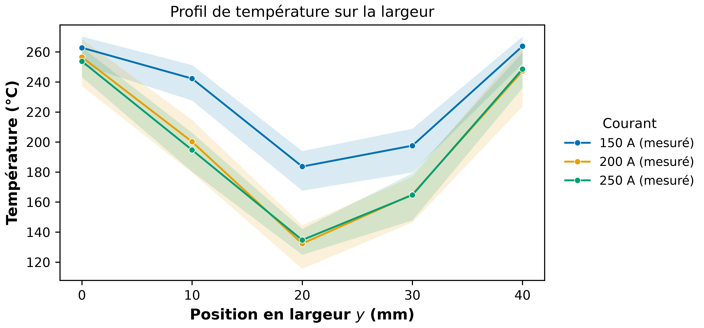
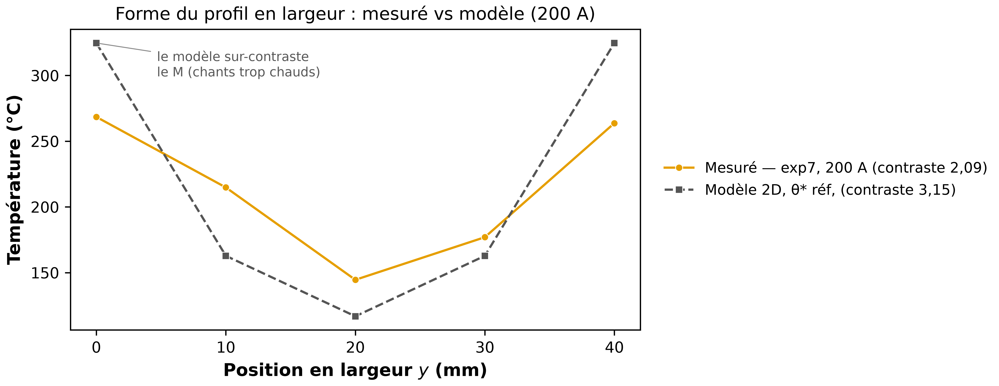
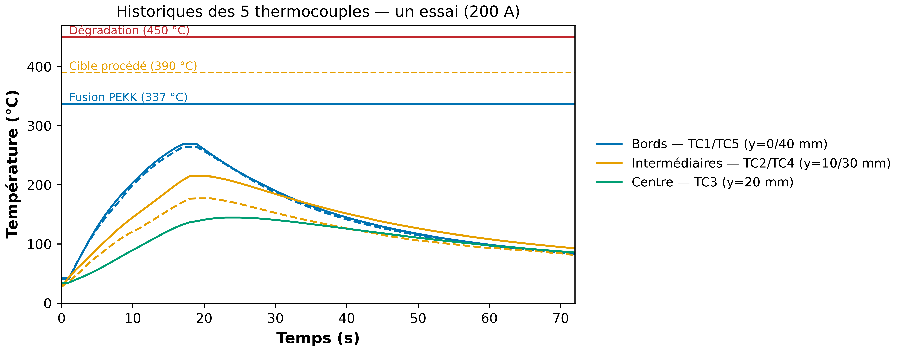
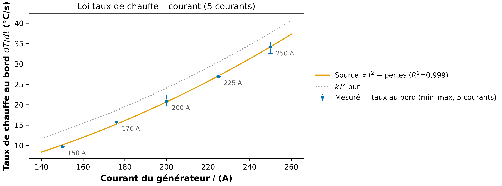
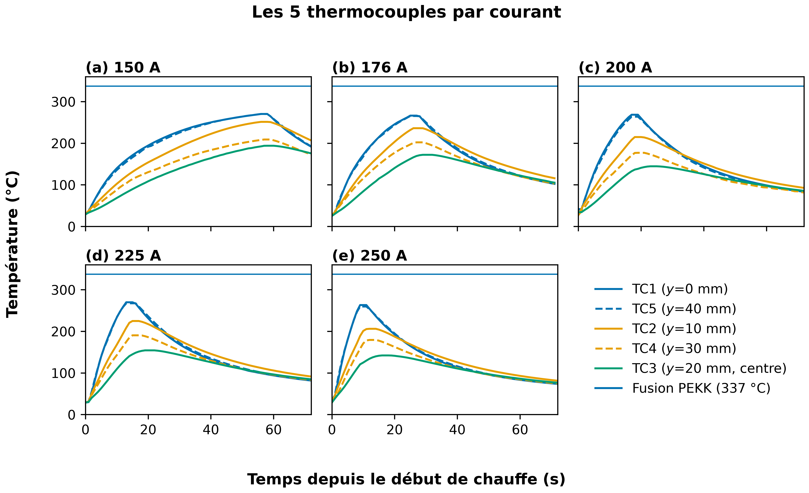
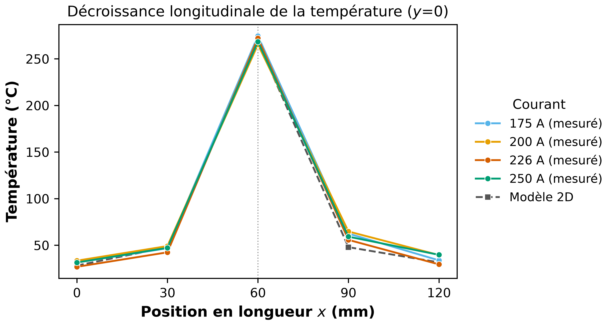
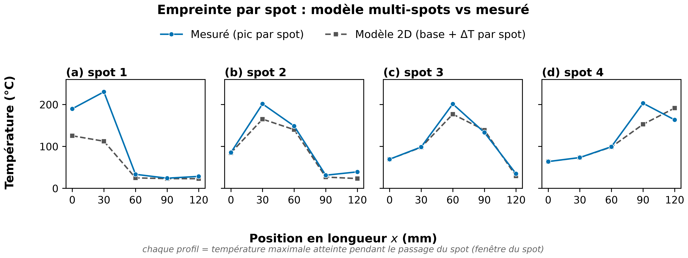
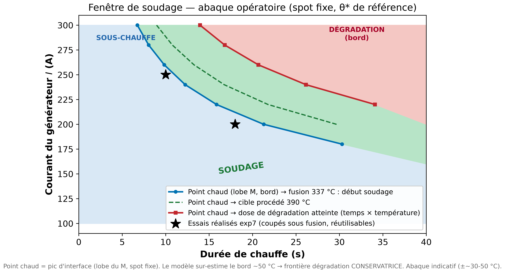

# Résultats **labo** (mesures expérimentales)

Cette partie regroupe tout ce qui vient des **essais physiques** : relevés thermocouples bruts,
protocoles et décisions de terrain. Les données brutes sont dans **[`../../data/`](../../data/)**
(non déplacées : référencées par les scripts et les essais formels `code/config/essais/`).

## Campagnes de mesures (`donnees/data/`)

| Campagne | Dossier | Contenu |
|---|---|---|
| **Série A** | `donnees/data/Serie A/` | Essais historiques 3–5 TC (A-1 calibration, A-3 aveugle). |
| **Série B** | `donnees/data/Serie B/` | Essai basse consigne B-2 (loi thermostat « capteurs »). |
| **exp7 — profil M (largeur)** | `donnees/data/exp7_bord-centre_2026-07-28_avec-ceramique/` | Cartographie bord→centre, 5 TC, 5 courants (150/176/200/225/250 A), **avec céramique** (géométrie de référence). Profil en M validé. |
| **exp9 — dissipation (bord y=0)** | `donnees/data/exp9_dissipation-longitudinale_2026-07-28/` | Décroissance longitudinale, spot fixe, monospot 175/200/226/250 A + semi-statique. Forme de source en longueur invariante en courant. |
| **exp9 — dissipation (centre y=20)** | `donnees/data/exp9_dissipation-longitudinale_2026-07-30/` | Ligne centrale (conduction dominante) → sonde `k_plan` / résidu d'étalement. |

Chaque campagne récente a son propre `README.md` détaillé dans son dossier `donnees/data/…`.

## Documents labo

- [`protocole_exp_dissipation_longitudinale.md`](protocole_exp_dissipation_longitudinale.md) — fiche protocole exp 9.
- [`mesures_a_realiser.md`](mesures_a_realiser.md) — mesures encore **à réaliser** (feuille de route terrain).
- [`releves_resolus.md`](releves_resolus.md) — relevés/questions de terrain déjà **tranchés** (archive).

## Figures (mesures) — `figures/`

Figures **utilisant les données expérimentales** (exp7/exp9, séries A/B). Le jeu complet
(dont les variantes `presentation_*` pour les slides, le poster et la figure de référence
`serieA_A-2_250A_2026-06-09.png`) est dans [`figures/`](figures/).

### exp7 — profil en « M » (largeur) et loi en courant

*Profil de température en largeur au pic, mesuré à 3 courants — chants chauds (y=0/40 mm), creux au centre (y=20 mm).*

*Forme du M, mesuré vs modèle (200 A) — le modèle sur-contraste le rapport bord/centre.*

*Les 5 historiques T(t) bruts d'un essai (200 A), groupés par symétrie de position.*

*Taux de chauffe au chant en fonction du courant (loi en I², R²=0,999).*

*Un panneau par courant, les 5 TC mesurés — profil M à chaque courant.*

### exp9 — dissipation longitudinale (bord y=0)

*Décroissance de ΔT le long de la longueur, spot centré — la source en longueur est raide.*

*Procédé semi-statique : la tête s'indexe à 4 positions successives.*

### Fenêtre de soudage (abaque)

*Abaque opératoire courant × durée, ancré sur les durées mesurées exp7 (150/200/250 A).*

## Sécurité échantillon (rappel)
Les bords (y=0 / y=40) montent ~2× plus que le centre (profil M). Pour ne pas souder/dégrader
les bords, plafonner le pic au **centre** à ~150 °C (fusion PEKK 337 °C au bord) ou ~125 °C pour
garder l'échantillon réutilisable. Un TC témoin au bord mesure le contraste réel.

> Côté **modèle** (simulations, validation, figures, θ\*) : voir [`../modele/README.md`](../modele/README.md).
