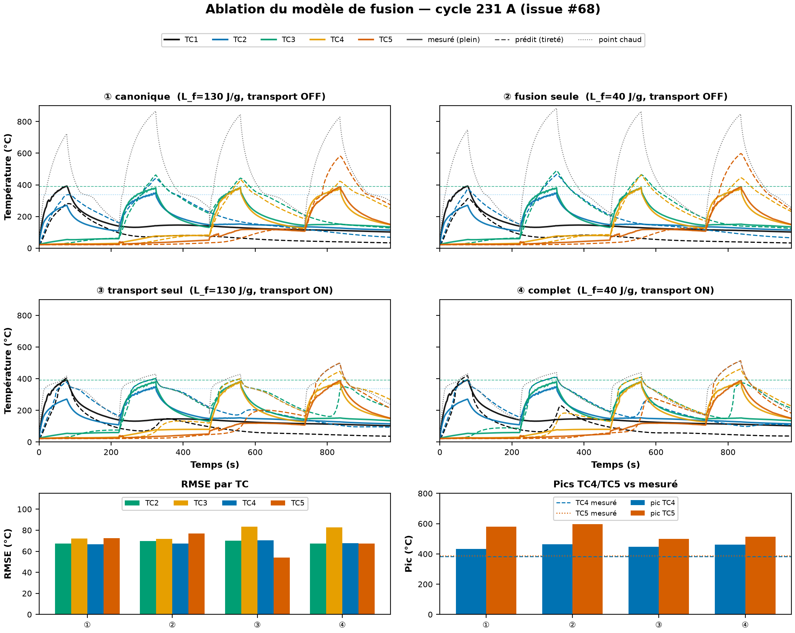
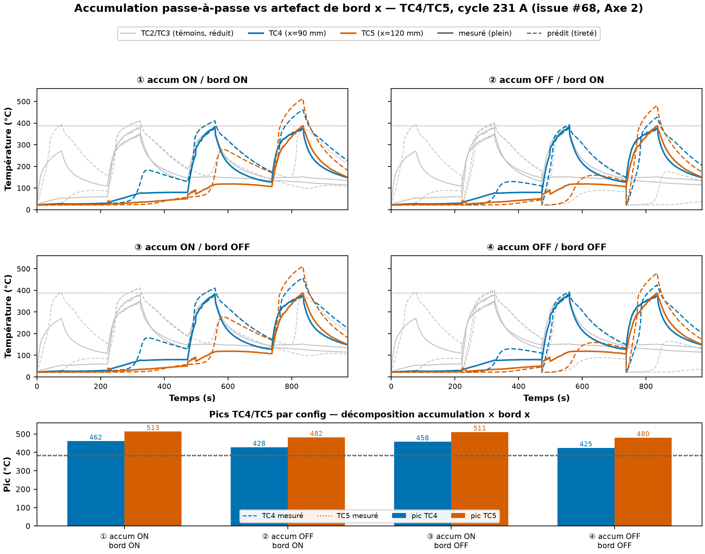
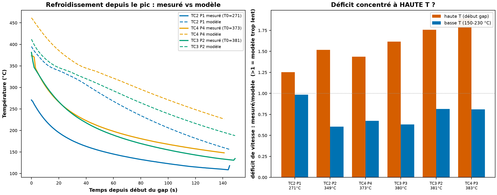
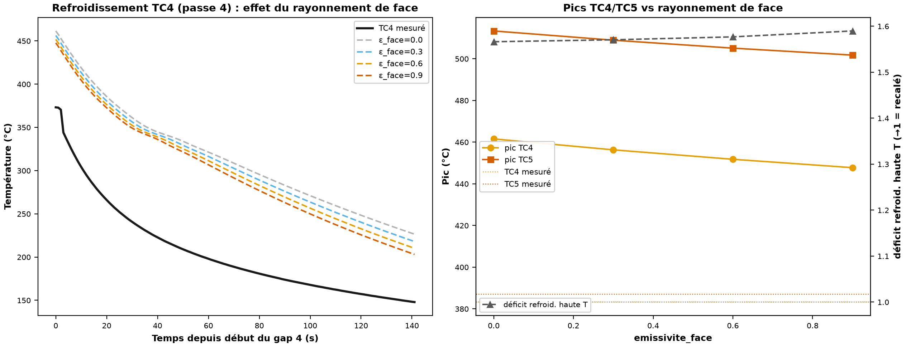
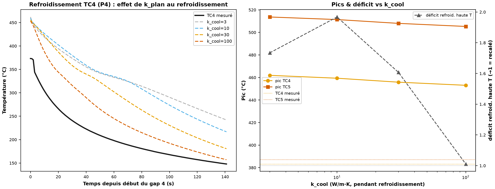
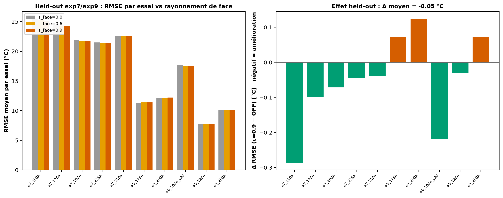

# Pourquoi le modèle de fusion est-il plus fidèle, et pourquoi TC4/TC5 s'emballent-ils ?

> **Archive de l'issue #68** (close le 2026-08-31). Synthèse de l'investigation « robustesse du modèle de fusion + emballement TC4/TC5 ». Figures dans `biblio/labo/figures/`, détails par étape dans les `.md` voisins.

> Note de synthèse — récit complet et lisible de l'investigation. Les tableaux détaillés et les logs bruts restent dans les commentaires ci-dessous ; ce texte raconte l'histoire et pointe ce qu'il faut retenir. Chaque étape porte sa figure.

## En deux minutes

L'essai réel 231 A avait laissé deux questions ouvertes (#67) : *pourquoi* le modèle de fusion (Étape 4) reproduit-il si bien le plateau, et *pourquoi* seuls les capteurs aval TC4/TC5 s'emballent au-dessus de ce plateau. On a mené l'enquête en cinq temps. Voici ce qu'on a appris.

1. **Ce qui rend le modèle de fusion fidèle, c'est le transport du bain fondu — pas la chaleur latente.** Baisser l'énergie de fusion ne change presque rien ; c'est le fait que la matière fondue évacue la chaleur plus vite qui plafonne le point chaud.
2. **L'emballement de TC4/TC5 est de l'accumulation de chaleur d'une passe à l'autre — pas un artefact de bord.** Les deux capteurs, l'intérieur (TC4) comme celui du bord (TC5), débordent pour la **même** raison.
3. **La cause amont, c'est que le modèle refroidit ~3× trop lentement entre les passes** — un déficit concentré aux hautes températures.
4. **On a testé deux réparations, honnêtement écartées** : le rayonnement de face (améliore un peu mais ne recale pas la cinétique) et une conduction latérale plus forte (recale la cinétique locale mais repousse la chaleur vers l'aval au lieu de l'évacuer).
5. **Conclusion : ce déficit est une nouvelle facette d'une limite structurelle déjà connue et actée** (la conduction dans le plan, pilotée par un `k_plan` scalaire trop faible). TC4/TC5 aval restent non-pilotables — comme déjà dit à l'opérateur en #67.

**Seul livrable code adoptable de l'enquête :** un nouveau terme de **rayonnement de face** (flag, défaut OFF, sans régression), qui aide les cycles chauds et est neutre en validation croisée.

---

## Le point de départ

Sur l'essai 231 A, le meilleur accord venait du **modèle de fusion** : chaleur latente physique `L_f = 40 J/g` **et** transport du bain fondu (`k_plan` rehaussé au-dessus de la fusion). Deux leviers changés d'un coup — impossible de savoir lequel travaille. Et une bizarrerie : les capteurs intérieurs TC2/TC3 suivaient bien le plateau mesuré (~385 °C), mais TC4 et TC5 montaient à ~460 et ~510 °C **tout en gardant la forme du plateau**. Ce n'est pas une divergence brutale, c'est un **excès de niveau**. Il fallait comprendre les deux.

---

## Étape 1 — Ce qui crée le plateau : le transport, pas la fusion

Quand deux réglages changent ensemble et que ça marche, on les rallume un par un (**ablation**). On a donc croisé la chaleur latente `L_f` et le transport `k_plan(T>Tf)`, et comparé au réel sans rien recalibrer.

Le verdict est net. Baisser la chaleur latente **seule** ne plafonne rien (le point chaud reste à ~880 °C, panneaux du haut). Activer le transport **seul** fait chuter le point chaud de 866 à ~497 °C (panneaux du bas) — c'est-à-dire l'essentiel du gain. Physiquement : **une fois la matière fondue, elle évacue la chaleur latéralement plus vite**, ce qui écrête le point chaud. Ce n'est pas l'énergie dépensée à fondre qui sature l'interface. La chaleur latente n'est qu'un réglage fin.

Nuance à garder en tête : sur le RMSE de cycle, le modèle de fusion est mitigé (il améliore TC5 mais dégrade un peu TC3). Son vrai mérite est la **forme du plateau** et le **plafond physique du point chaud**, pas un RMSE plus bas partout.

---

## Étape 2 — Pourquoi TC4/TC5 débordent : l'accumulation, pas le bord

TC4 est un capteur **intérieur** (x = 90 mm), TC5 est **au bord** (x = 120 mm). L'intuition disait : TC5 déborde peut-être à cause de l'artefact de source au bord (déjà vu en #67), TC4 pour une autre raison. On a désactivé les deux causes une par une : l'**accumulation** de chaleur de passe en passe, et l'**artefact de bord**.

Résultat sans appel : couper l'accumulation fait retomber TC4 et TC5 (−34 et −32 °C), alors que couper l'artefact de bord ne les bouge quasiment pas (−4 et −2 °C) — un effet **9 à 14× plus faible**. **Les deux capteurs s'emballent pour la même raison, l'accumulation**, pas pour deux causes distinctes. L'hypothèse « TC5 = accumulation + bord » est réfutée. C'est cohérent avec la conclusion de #67 (le résidu de TC5 était déjà attribué au thermique, pas à la source).

---

## Étape 3 — La cause amont : le modèle refroidit trop lentement

Si l'accumulation déborde, c'est que la chaleur ne s'évacue pas assez vite **entre** les passes. On a donc mesuré, capteur par capteur, à quelle vitesse le modèle refroidit après chaque pic, comparé au réel.

Le modèle refroidit **~3× trop lentement** (bien plus que le « ~10 % » qu'on répétait). Et surtout, ce retard est **concentré aux hautes températures** : juste après le pic, le modèle est ~1,6× trop lent (barres oranges) ; une fois redescendu vers 150–230 °C, il est au contraire un peu trop rapide (barres bleues). Cette signature — trop lent quand c'est chaud, correct quand c'est froid — ressemblait d'abord à une perte par **rayonnement** manquante (le rayonnement grimpe en T⁴). C'est la piste qu'on est allé tester.

---

## Étape 4 — Deux réparations tentées, écartées honnêtement

**Piste A — le rayonnement de face.** Le modèle 2D n'applique le rayonnement qu'aux tranches de la plaque ; les grandes faces dessus/dessous n'ont qu'une perte linéaire, et la face du dessus, une fois le MFC parti, ne perdait *rien*. On a ajouté ce rayonnement manquant et balayé son intensité.

Ça **améliore le RMSE** et fait un peu baisser les pics — mais ça **ne recale pas la chute rapide** : sur la gauche, les courbes du modèle (tiretées) restent loin au-dessus de la mesure (noir), quelle que soit l'intensité. La signature en T⁴ était réelle, mais le rayonnement de face n'en est pas la cause.

**Piste B — la conduction latérale.** Nouvelle hypothèse : la chute rapide est de la conduction dans le plan que le modèle sous-représente (une fois sous la fusion, son `k_plan` retombe à 3 et la chaleur cesse de s'étaler). On a donc rehaussé la conduction pendant les phases de refroidissement.

Là, la cinétique **se recale** (à gauche, la courbe rouge épouse enfin la mesure) — donc **la conduction latérale est bien le mécanisme**. Mais le fit global **empire en aval** : le RMSE de TC5 passe de 62 à 103 °C. La raison est physique et importante : la conduction latérale **redistribue** la chaleur (elle refroidit le point chaud en la poussant vers le bord, qu'elle préchauffe) — elle ne l'**évacue** pas. Le vrai stratifié, lui, refroidit *partout* vers des températures basses : la chaleur est réellement **perdue**.

---

## Ce que ça veut dire, au fond

Ni une perte de surface, ni une conduction latérale scalaire ne suffisent seules. Un `k_plan` scalaire ne peut pas refroidir un point localement sans sur-étaler vers l'aval. **C'est exactement le résidu structurel déjà documenté et clos du jumeau** : la conduction dans le plan est pilotée par un `k_plan` scalaire trop faible (~3 en config contre ~7,5 en calibration), et aucune valeur scalaire — ni même une conduction anisotrope, déjà testée et réfutée en held-out — ne concilie tous les régimes. Le déficit de refroidissement n'est donc pas un problème neuf : c'est **la même limite, vue sous l'angle de la cinétique de refroidissement**.

**Conséquence opérateur, inchangée depuis #67** : les capteurs aval TC4/TC5 restent **non-pilotables** de façon fiable. On valide et on pilote sur les intérieurs TC2/TC3.

---

## Le seul acquis code adoptable : le rayonnement de face

Même s'il ne résout pas l'accumulation, le rayonnement de face est un **vrai manque physique** qu'on a comblé proprement (flag, défaut OFF, aucune régression sur les 123 tests). Reste à savoir s'il vaut la peine d'être adopté : on l'a passé au crible de la **validation croisée** sur les 10 essais formels exp7/exp9, sans aucun recalage.

Il est **neutre** : RMSE moyen 17,48 → 17,42 °C (Δ = −0,05), et aucun essai ne régresse (tous les écarts sous 0,3 °C). Il est quasi inactif sur ces essais mono-spot (à température plus basse, le rayonnement pèse peu) et **aide** les cycles chauds type 231 A. C'est le profil idéal d'un ajout physique : utile là où ça compte, inoffensif ailleurs. **Contrairement à la recalibration de `k_plan` (held-out NO-GO), celui-ci est adoptable.**

**Décision à prendre :** garder le flag **OFF par défaut** (prudent — le gain moyen est marginal, le vrai bénéfice est sur les cycles chauds), ou l'**activer par défaut** à l'émissivité matériau (0,96) pour la cohérence physique. Recommandation : le garder OFF pour l'instant et le documenter comme option validée.

---

## Récapitulatif

| Question | Réponse | Preuve |
|---|---|---|
| Qu'est-ce qui rend le modèle de fusion fidèle ? | Le **transport** du bain fondu (pas la chaleur latente) | ablation `L_f` × transport |
| Pourquoi TC4/TC5 s'emballent ? | **Accumulation** passe-à-passe (même cause pour les deux, pas le bord) | décorrélation accumulation × bord |
| Pourquoi l'accumulation ? | Le modèle **refroidit ~3× trop lentement**, surtout à haute T | diagnostic du refroidissement |
| Un rayonnement de face manquant ? | Non — améliore le RMSE mais ne recale pas la cinétique | test du rayonnement de face |
| Une conduction latérale manquante ? | C'est le **mécanisme**, mais un `k_plan` scalaire redistribue au lieu d'évacuer | diagnostic conduction latérale |
| Peut-on corriger ? | Non — c'est la **limite structurelle `k_plan`** déjà actée ; TC4/TC5 aval non-pilotables | (synthèse) |
| Un livrable adoptable ? | Oui — le **rayonnement de face** (flag OFF, held-out neutre) | held-out exp7/exp9 |

Chaque étape a son script reproductible ; le détail chiffré est dans les commentaires de l'issue #68. Investigation close, sauf la décision d'activation du flag rayonnement de face.

---

## Artefacts (repo)

Le détail chiffré de chaque étape vit dans les commentaires de l'issue #68 ; ce document en est la synthèse. Scripts reproductibles et figures :

| Étape | Script | Figure |
|---|---|---|
| Axe 1 — ablation | `code/scripts/gen/gen_ablation_fusion_231A.py` | `figures/fig_ablation_fusion_231A.png` |
| Axe 2 — accumulation/bord | `gen_axe2_accumulation_bord_tc45_231A.py` | `figures/fig_axe2_tc45_231A.png` |
| Diagnostic refroidissement | `gen_diag_refroidissement_231A.py` | `figures/fig_diag_refroidissement_231A.png` |
| Test rayonnement de face | `gen_test_rayonnement_face_231A.py` | `figures/fig_test_rayonnement_face_231A.png` |
| Diagnostic conduction latérale | `gen_diag_conduction_laterale_231A.py` | `figures/fig_diag_conduction_laterale_231A.png` |
| Held-out rayonnement de face | `gen_heldout_rayonnement_face.py` | `figures/fig_heldout_rayonnement_face.png` |

**Code adopté** : flag `SolveurThermique2D(emissivite_face=)` et `Essai.simuler(emissivite_face=)` — **défaut 0.0 (OFF), conservé OFF par décision** (2026-08-31). Bit-à-bit, 123 tests verts. Held-out neutre (adoptable, non activé par défaut).

---

## En mots simples

**Le problème de départ.** On chauffe une plaque composite par induction, en quatre passages successifs, et on surveille la température avec cinq capteurs alignés. Les capteurs du milieu montaient à la bonne température dans notre simulation, mais les **deux capteurs du bout chauffaient beaucoup trop** dans le modèle par rapport à la réalité. On voulait deux choses : comprendre *pourquoi* notre meilleur modèle marchait bien, et *pourquoi* ces deux capteurs débordaient.

**Comment on l'a résolu, physiquement.** On a procédé comme un médecin qui éteint une cause à la fois pour voir laquelle compte. On a découvert, dans l'ordre : (1) ce qui empêche la matière de surchauffer, ce n'est pas l'énergie qu'elle absorbe en fondant, c'est que **la matière fondue étale la chaleur** plus vite ; (2) les capteurs du bout débordent parce que **la chaleur s'accumule** d'un passage au suivant, comme une pièce qu'on n'a pas le temps de refroidir entre deux feux ; (3) le vrai coupable, c'est que **notre modèle refroidit trop lentement** entre les passages. On a alors testé deux réparations physiques concrètes — ajouter le rayonnement de chaleur par la face du dessus, puis augmenter la façon dont la chaleur file sur les côtés. Aucune ne règle tout : la première aide un peu, la seconde déplace le problème au lieu de l'effacer. La raison est claire et honnête : **c'est une limite connue du matériau lui-même** (sa capacité à conduire la chaleur dans le plan), qu'on ne peut pas forcer sans casser tout le reste.

**Ce qu'on a obtenu.** On comprend maintenant **exactement** pourquoi les deux capteurs du bout débordent, et on sait que c'est une **limite bornée et documentée**, pas un bug à chasser. On a aussi ajouté au passage **un vrai morceau de physique qui manquait** (le rayonnement de la face du dessus), qui améliore les cas les plus chauds sans rien dégrader ailleurs — c'est vérifié sur d'autres essais.

**Pourquoi c'est une bonne chose pour la suite.** Concrètement, on sait désormais **sur quels capteurs se fier pour piloter le procédé** (ceux du milieu) et lesquels ne servent que d'indication (ceux du bout). On a **fermé plusieurs fausses pistes une bonne fois pour toutes**, donc on ne perdra plus de temps à les re-tester. Et on garde **un nouvel outil physique prêt à l'emploi** pour les cycles chauds si on en a besoin. Au total : le modèle est mieux compris, ses limites sont nettes, et on peut avancer avec confiance.
