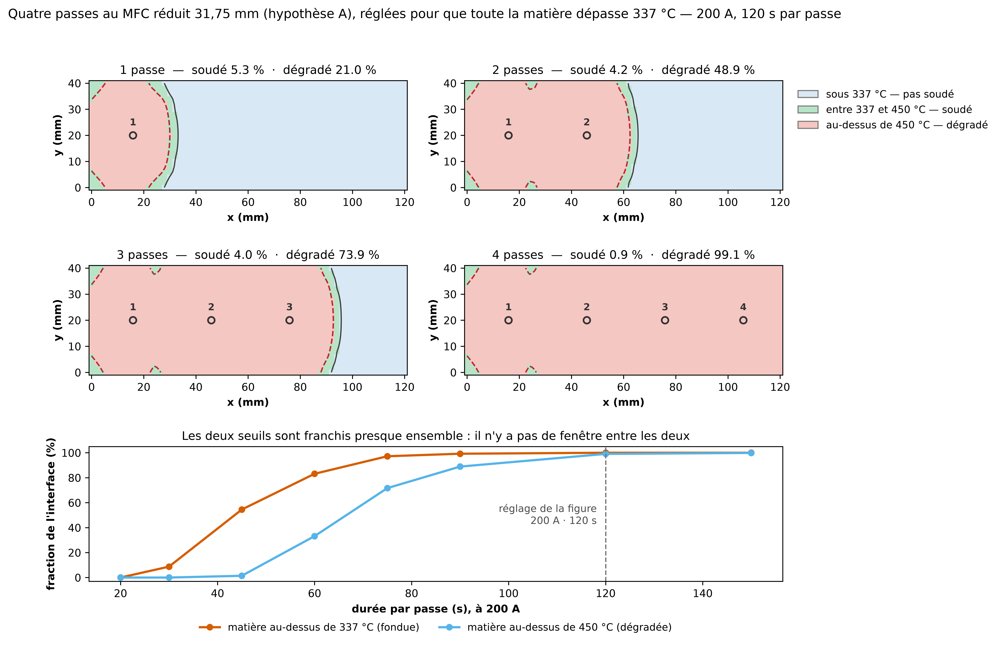

# Faire dépasser 337 °C à toute la matière en quatre passes, et ce que ça coûte

Généré le 2026-09-16. MFC réduit 31,75 mm, hypothèse la plus favorable, pas de 30 mm, 200 A, 120 s par passe.

| après | au-dessus de 337 °C | dégradé | T min | T max |
|---|---|---|---|---|
| 1 passe | 26.3 % | 21.0 % | 20 °C | 785 °C |
| 2 passes | 53.2 % | 48.9 % | 20 °C | 850 °C |
| 3 passes | 77.9 % | 73.9 % | 58 °C | 892 °C |
| 4 passes | 100.0 % | 99.1 % | 375 °C | 954 °C |

### Balayage de la durée de passe, à 200 A

| durée par passe | > 337 °C | dégradé |
|---|---|---|
| 20 s | 0.0 % | 0.0 % |
| 30 s | 8.7 % | 0.0 % |
| 45 s | 54.5 % | 1.4 % |
| 60 s | 83.1 % | 33.2 % |
| 75 s | 97.2 % | 71.7 % |
| 90 s | 99.2 % | 88.9 % |
| 120 s | 100.0 % | 99.1 % |
| 150 s | 100.0 % | 99.8 % |

**La contrainte est géométrique, pas énergétique.** Le point le plus froid et le plus chaud sont dans un rapport d'environ 3, et ce rapport ne descend pas quand on chauffe plus : monter la puissance monte les deux ensemble. Le froid vient de deux endroits que la source n'atteint pas — le centre de la largeur, ligne nodale de la dissipation, et les extrémités en longueur au-delà des passes extrêmes.

La dégradation est jugée en **temps × température** (`jumeau.thermique.dose_degradation`), pas au seuil de pic — ce qui change le verdict des maintiens longs.

Reproduire : `.venv/bin/python code/scripts/gen/gen_4passes_toute_matiere_337.py`
