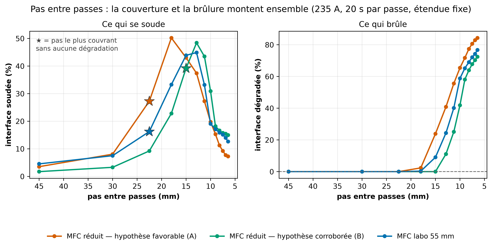

# Y a-t-il un pas entre passes qui soude sans brûler ?

Généré le 2026-09-16. Étendue fixe (`x` = 15.9 → 105.9 mm, celle du procédé semi-statique réel), spot centré en largeur, 235 A, 20 s par passe. Seul le pas varie — donc le nombre de passes, donc l'énergie déposée.

## Le pas le plus couvrant sans aucune dégradation

| configuration | pas | passes | soudé | dégradé |
|---|---|---|---|---|
| MFC réduit — hypothèse favorable (A) | 22.5 mm | 5 | 27.2 % | 0.0 % |
| MFC réduit — hypothèse corroborée (B) | 15.0 mm | 7 | 39.2 % | 0.0 % |
| MFC labo 55 mm | 22.5 mm | 5 | 16.2 % | 0.0 % |

## Le balayage complet

| pas (mm) | passes | MFC réduit — hypothèse favorable (A) — soudé / dégradé | MFC réduit — hypothèse corroborée (B) — soudé / dégradé | MFC labo 55 mm — soudé / dégradé |
|---|---|---|---|---|
| 45.0 | 3 | 3.5 % / 0.0 % | 1.7 % / 0.0 % | 4.5 % / 0.0 % |
| 30.0 | 4 | 8.0 % / 0.0 % | 3.3 % / 0.0 % | 7.5 % / 0.0 % |
| 22.5 | 5 | 27.2 % / 0.0 % | 9.2 % / 0.0 % | 16.2 % / 0.0 % |
| 18.0 | 6 | 50.2 % / 2.3 % | 22.8 % / 0.0 % | 33.3 % / 0.3 % |
| 15.0 | 7 | 43.0 % / 23.9 % | 39.2 % / 0.0 % | 43.9 % / 9.1 % |
| 12.9 | 8 | 37.4 % / 40.8 % | 48.4 % / 11.1 % | 44.9 % / 24.4 % |
| 11.2 | 9 | 27.2 % / 55.6 % | 43.5 % / 25.1 % | 33.2 % / 40.1 % |
| 10.0 | 10 | 19.8 % / 65.4 % | 30.9 % / 41.8 % | 19.0 % / 58.8 % |
| 9.0 | 11 | 15.3 % / 71.7 % | 18.2 % / 58.1 % | 17.1 % / 65.2 % |
| 8.2 | 12 | 11.2 % / 77.4 % | 16.6 % / 63.9 % | 15.8 % / 69.0 % |
| 7.5 | 13 | 9.2 % / 80.6 % | 15.8 % / 67.8 % | 15.1 % / 72.1 % |
| 6.9 | 14 | 7.7 % / 82.9 % | 15.5 % / 70.3 % | 14.0 % / 74.2 % |
| 6.4 | 15 | 7.3 % / 84.3 % | 15.0 % / 72.4 % | 12.6 % / 76.7 % |

## Réserves

- **Ce n'est pas une comparaison à énergie égale.** Resserrer le pas ajoute des passes : le pas le plus serré du tableau dépose plusieurs fois l'énergie du plus large.
- **Le critère de dégradation est conservateur.** Le seuil est appliqué à une interface calculée avec la config canonique (chaleur latente 130 J/g, sans plateau de fusion), qui surestime au-delà du point de fusion — 865 contre 508 °C sur le cycle 231 A. Un pas déclaré sans dégradation l'est donc à coup sûr ; un pas déclaré dégradant peut ne pas l'être.
- **Le résidu structurel du jumeau joue dans le sens conservateur** pour la couverture : le centre du modèle se remplit trop lentement, donc la couverture réelle devrait être un peu meilleure que celle calculée.
- Aucune des hypothèses de MFC réduit n'est de la physique établie ; c'est la campagne #55 qui dira laquelle décrit le concentrateur réel.

Reproduire : `.venv/bin/python code/scripts/gen/gen_balayage_pas_mfc_reduit.py`
