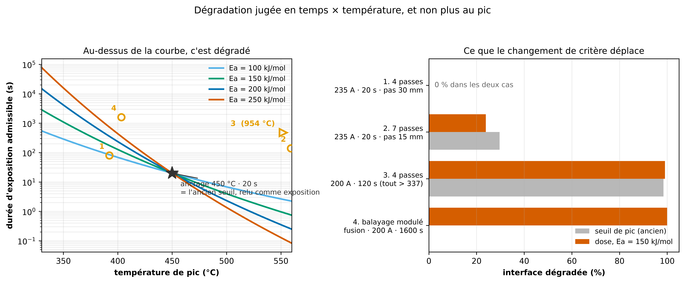

# Refaire le critère de dégradation : temps × température

Généré le 2026-09-15.

## Ce qui clochait

Tout le projet juge la dégradation sur un **seuil de pic** : dégradé si `T_max > 450 °C`. Deux défauts :

- **Ce seuil n'a aucune provenance.** C'est un littéral répété dans huit scripts, absent de `materiaux.yaml` et de toute référence du corpus. Aucune donnée de cinétique (TGA, Arrhenius) sur le PEKK n'existe dans la bibliographie du projet.
- **Il ne voit qu'un facteur.** Il déclare identiques une brève excursion à 450 °C et une demi-heure de maintien à 400 °C. Les calculs de modulation ont buté exactement là.

## Ce qui le remplace

Dose d'Arrhenius du premier ordre (`code/src/jumeau/thermique/dose_degradation.py`) :

$$D = \frac{1}{t_{ref}} \int \exp\left(-\frac{E_a}{R}\left(\frac{1}{T(t)} - \frac{1}{T_{ref}}\right)\right) dt \qquad \text{dégradé si } D > 1$$

**L'ancrage ne crée aucun seuil nouveau** : `D = 1` correspond exactement à l'ancien critère relu comme une exposition — 450 °C pendant une durée de passe (20 s). La seule hypothèse ajoutée est l'énergie d'activation.

Lu en durée admissible à température constante (Ea = 150 kJ/mol) :

| température | durée admissible |
|---|---|
| 337 °C | 2030 s |
| 360 °C | 694 s |
| 380 °C | 290 s |
| 400 °C | 128 s |
| 420 °C | 59 s |
| 450 °C | 20 s |
| 480 °C | 7 s |

## Ce que le changement de critère déplace

| scénario | pic | durée | ancien : soudé / dégradé | Ea=100 | Ea=150 | Ea=200 | Ea=250 |
|---|---|---|---|---|---|---|---|
| 4 passes · 235 A · 20 s · pas 30 mm | 392 °C | 80 s | 8 / 0 % | 8 / 0 % | 8 / 0 % | 8 / 0 % | 8 / 0 % |
| 7 passes · 235 A · 20 s · pas 15 mm | 559 °C | 140 s | 37 / 30 % | 40 / 27 % | 43 / 24 % | 44 / 23 % | 44 / 23 % |
| 4 passes · 200 A · 120 s (tout > 337) | 954 °C | 480 s | 2 / 98 % | 1 / 99 % | 1 / 99 % | 1 / 99 % | 1 / 99 % |
| balayage modulé · fusion · 200 A · 1600 s | 403 °C | 1600 s | 100 / 0 % | 0 / 100 % | 0 / 100 % | 0 / 100 % | 16 / 84 % |

(colonnes Ea : soudé / dégradé, en %)

## Règle de lecture

`Ea` n'est pas mesurée dans ce projet. **Un résultat qui change de signe entre 100 et 250 kJ/mol doit être dit indécidable, pas tranché.** Le balayage est là pour ça, et il fait partie du résultat — pas d'une annexe.

Reproduire : `.venv/bin/python code/scripts/gen/gen_critere_dose_degradation.py`
