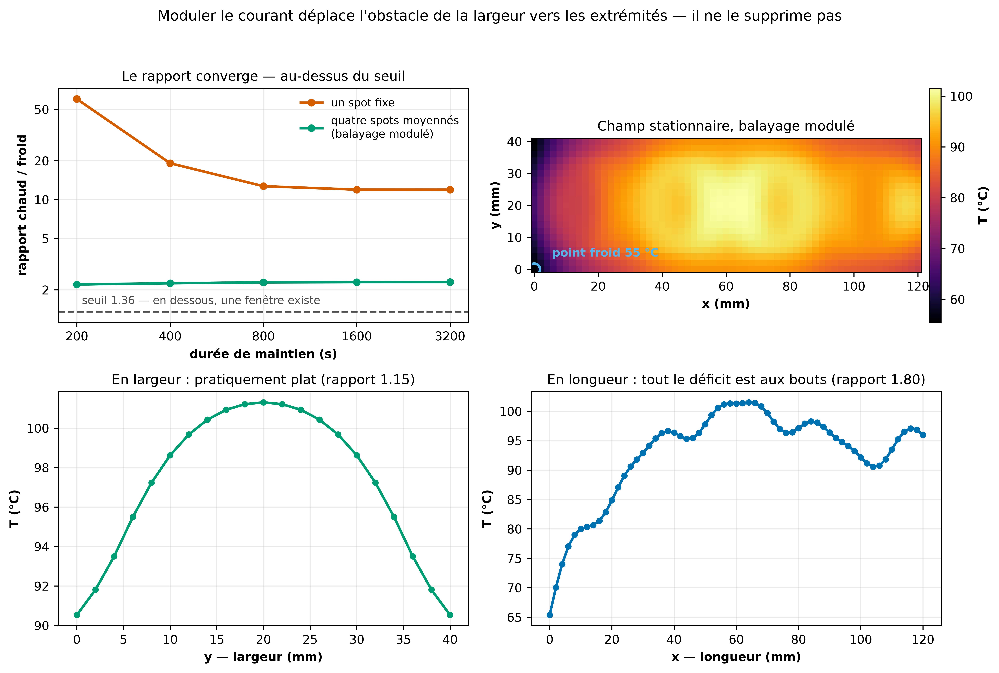

# Moduler le courant peut-il éviter la dégradation et souder toute la plaque ?

Généré le 2026-09-15.

## L'argument, et sa vérification

À l'état stationnaire, avec des propriétés indépendantes de la température et des pertes linéaires, le champ s'écrit `T − T_ambiant = amplitude × forme(x, y)`. Le **rapport** entre le point le plus chaud et le plus froid ne dépend donc pas de l'amplitude — et moduler le courant n'agit que sur l'amplitude. Vérification numérique, à puissance doublée :

| courant | rapport chaud/froid |
|---|---|
| 80 A | 2.295 |
| 113 A | 2.309 |

Si ce rapport dépasse **(450 − 20) / (337 − 20) = 1.356**, aucune conduite du courant ne peut mettre toute la plaque entre fusion et dégradation.

## Le rapport asymptotique

| durée de maintien | un spot fixe | quatre spots moyennés (balayage modulé) |
|---|---|---|
| 200 s | 60.13 | 2.20 |
| 400 s | 19.12 | 2.25 |
| 800 s | 12.70 | 2.29 |
| 1600 s | 11.95 | 2.29 |
| 3200 s | 11.94 | 2.30 |

Le champ met environ 1500 s à converger. La deuxième colonne est le **meilleur cas atteignable** : la limite d'un balayage assez rapide et modulé pour que la plaque ne voie plus que la source moyenne.

## Ce que le calcul dit vraiment

**Non, la modulation ne ferme pas le problème** — mais elle en déplace le siège, et c'est le résultat utile.

- **En largeur, c'est résolu.** Le profil transverse au stationnaire vaut 91 / 99 / 101 / 99 / 91 °C de `y` = 0 à 40 mm, soit un rapport de **1.15**. Tenir la plaque longtemps fait ce qu'aucun réglage transitoire n'obtenait : la conduction latérale remplit le centre.
- **L'obstacle est passé aux extrémités en longueur**, rapport 1.80. Le point le plus froid est le coin `x` = 0 mm, `y` = 0 mm, à 55 °C contre 102 au point chaud.
- **Étaler les passes n'aide pas** : portées jusqu'aux bouts de la plaque, elles font monter le rapport de 2,30 à 3,63 — la même puissance répartie plus mince perd davantage aux bords.

## Deux raisons de ne pas clore la question

- **Le point froid limitant est là où le modèle est le plus faible.** `h_bord_x0 = 125` au chant `x` = 0 est un paramètre *effectif, sans base physique* — au montage, les chants sont tous libres. Le verrou de ce calcul repose donc sur l'élément le moins fiable du jumeau.
- **La fusion est elle-même un thermostat, et il est absent de ce calcul.** Le régime linéaire retenu ici pour rendre le rapport indépendant de l'amplitude écarte précisément le mécanisme qui jouerait en faveur de l'idée : la chaleur latente absorbe l'énergie au point chaud pendant que le point froid continue de monter. Le modèle de fusion (flag, non adopté) plafonne le point chaud de 865 à 508 °C sur le cycle 231 A. **Le rapport calculé ici est donc un majorant.**

Reproduire : `.venv/bin/python code/scripts/gen/gen_modulation_courant_limite.py`
