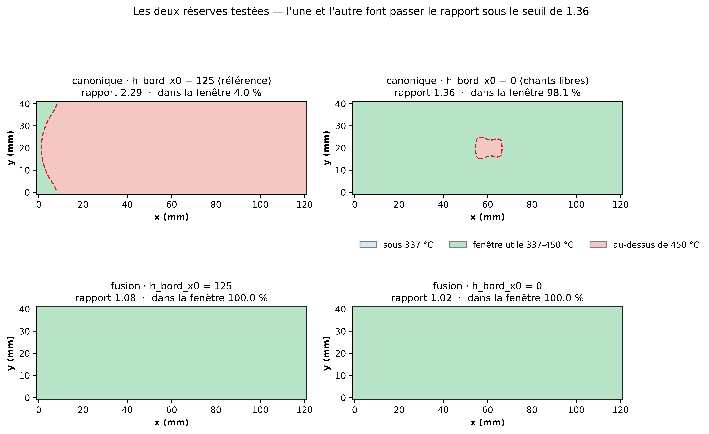

# Les deux réserves du calcul de modulation, testées

Généré le 2026-09-15. Source moyenne des quatre spots (limite d'un balayage modulé), maintien 1600 s. Fenêtre utile = interface entre 337 et 450 °C ; seuil de rapport chaud/froid en dessous duquel une fenêtre peut exister : **1.356**.

## Levier 1 — la condition de bord en `x` = 0

Le point le plus froid tombait au coin `x` = 0, où `h_bord_x0 = 125` est un paramètre effectif sans base physique. ⚠️ `h_bord_x0 = 0` est **réfuté comme calibration** (+98 °C sur TC1 en transitoire, cf. issue #69) : ce test n'est pas une réouverture de ce verdict mais une mesure de **sensibilité**.

| h_bord_x0 | rapport chaud/froid | dans la fenêtre |
|---|---|---|
| 125 | 2.29 | 4.0 % |
| 0 | 1.36 | 98.1 % |

## Levier 2 — le plateau de fusion

**Une distinction décide du résultat** : la chaleur latente est un tampon *transitoire*. Une fois la matière passée par la zone de fusion, elle n'absorbe plus rien et ne pèse plus sur l'état stationnaire. Ce qui subsiste, c'est `k_plan(T > Tf) = 100` : le bain conduit ~33 fois mieux et aplanit le champ **là où il est déjà fondu** — pas aux extrémités, restées sous Tf.

| h_bord_x0 | courant | T min | T max | rapport | dans la fenêtre |
|---|---|---|---|---|---|
| 125 | 200 A | 375 °C | 403 °C | 1.08 | 100.0 % |
| 125 | 230 A | 465 °C | 501 °C | 1.08 | 0.0 % |
| 125 | 260 A | 554 °C | 598 °C | 1.08 | 0.0 % |
| 125 | 290 A | 639 °C | 694 °C | 1.09 | 0.0 % |
| 0 | 200 A | 416 °C | 426 °C | 1.02 | 100.0 % |
| 0 | 230 A | 511 °C | 525 °C | 1.03 | 0.0 % |
| 0 | 260 A | 603 °C | 623 °C | 1.03 | 0.0 % |
| 0 | 290 A | 690 °C | 718 °C | 1.04 | 0.0 % |

## Ce que ces chiffres renversent — et ce qu'ils ne prouvent pas

**Les deux réserves étaient fondées, et le verdict précédent ne tient pas.** Il concluait qu'aucune conduite du courant ne peut mettre la plaque dans la fenêtre utile, sur la foi d'un rapport de 2,30. Chacun des deux leviers, pris seul, passe sous le seuil. Le calcul d'origine avait été fait en régime linéaire **précisément pour rendre l'argument propre** — et cette linéarisation écartait le mécanisme dominant.

Mais trois choses interdisent de lire ces 100 % comme « la modulation marche » :

- **Le critère de dégradation ignore le temps.** Il compare une température de pic à 450 °C. Or ces cellules sont des maintiens de 1600 s : tenir toute la plaque à 400 °C pendant vingt-sept minutes n'a rien d'équivalent à une brève excursion à 450 °C. La dégradation thermique est un produit temps × température, et le critère employé ici n'en voit qu'un facteur. C'est la limite la plus sérieuse des quatre cellules.
- **Dans les cellules à fusion, la plaque entière est fondue** (point le plus froid à 375 °C, au-dessus de Tf). Ce n'est pas une soudure, c'est une plaque liquide tenue une demi-heure — elle ne garderait pas sa géométrie. Et `k_plan(T > Tf) = 100` est un **transport effectif** calibré sur le plateau d'un bain LOCALISÉ ; l'appliquer à une plaque intégralement fondue est une extrapolation large.
- **La fenêtre en courant est extrêmement étroite** : 100 % à 200 A, 0 % à 230 A, tout étant alors au-dessus du seuil. C'est précisément le problème de conduite qu'une modulation est censée résoudre — mais cela montre aussi que la marge est mince.

**Conclusion honnête : le verdict « la modulation ne peut pas » n'est pas robuste.** Il dépendait d'un paramètre de bord sans base physique et d'une linéarisation qui excluait la physique utile. Ce qui le remplace n'est pas « la modulation marche », mais une question ouverte, et un critère de dégradation à refaire en temps × température avant d'aller plus loin.

Reproduire : `.venv/bin/python code/scripts/gen/gen_modulation_deux_leviers.py`
