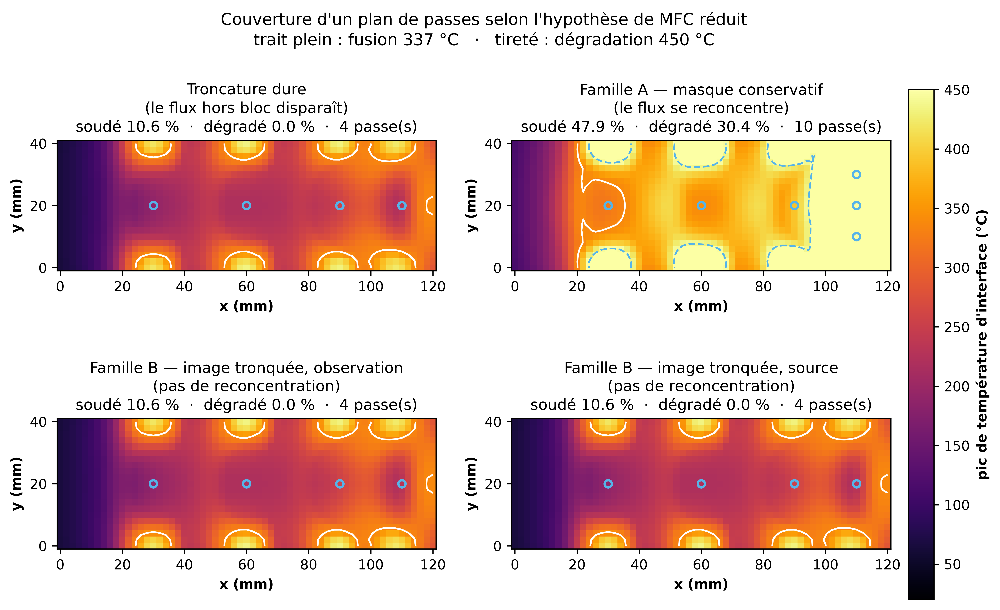

# Le verdict « pas de soudage uniforme » survit-il au changement d'hypothèse sur le MFC réduit ?

Généré le 2026-09-15. Plan de passes glouton puis vérification séquentielle (chaleur résiduelle incluse), seuils fusion 337 °C / dégradation 450 °C.

## Contrôle d'attribution

Avant toute comparaison, la configuration historique est rejouée : troncature dure, `h_bord_x0 = 250`, courants {200, 235} A.

| | publié (#31/#37/#39) | rejoué |
|---|---|---|
| soudé, plan glouton | 6.1 % | 6.1 % |
| soudé, séquentiel | 7.0 % | 7.0 % |

Deux choses séparent ce contrôle de la matrice qui suit : le θ* et la grille de courants. Les découpler évite d'attribuer à l'un ce qui vient de l'autre.

| grille de courants | h_bord_x0 | soudé, séquentiel |
|---|---|---|
| {200, 235} A | 250 (historique) | 7.0 % |
| {200, 235} A | 125 (canonique) | 7.0 % |

**Le θ* ne bouge rien ici**, et c'est attendu : `h_bord_x0` n'agit que sur le chant `x = 0`, alors que la couverture se joue sur les lobes du M, c'est-à-dire sur les chants en `y`. Tout l'écart avec la matrice ci-dessous vient donc de l'ajout de 250 A à la grille — la correction de θ* était nécessaire par cohérence, pas parce qu'elle changeait le verdict.

## Les quatre hypothèses, à θ* canonique

`h_bord_x0 = 125` (canonique depuis le 2026-09-06) et courants {200, 235, 250} A — la grille est ÉLARGIE vers le haut, donc le planificateur ne peut qu'y faire mieux.

| hypothèse sur le flux hors empreinte | soudé | dégradé | passes | MFC réduit retenu | uniforme |
|---|---|---|---|---|---|
| il disparaît (troncature dure) | 10.6 % | 0.0 % | 4 | non | NON |
| il se reconcentre (famille A) | 44.9 % | 33.4 % | 10 | oui | NON |
| il ne se reconcentre pas — obs. (famille B) | 10.6 % | 0.0 % | 4 | non | NON |
| il ne se reconcentre pas — source (famille B) | 10.6 % | 0.0 % | 4 | non | NON |

Trois des quatre panneaux de la figure sont identiques. Ce n'est pas une redondance de tracé : dans ces trois hypothèses le planificateur glouton **ne retient aucune passe au MFC réduit**, si bien que le plan se réduit aux mêmes passes au MFC labo 55 mm.

## Où se lit la physique : une passe unique

Une seule passe centrée en `x = 60 mm`, `y = 20 mm`, 235 A, 20 s. Le centre de la largeur est la **ligne nodale de la dissipation** (la puissance Joule y est nulle par symétrie) : il ne chauffe que par conduction latérale.

| hypothèse | pic (°C) | centre de la largeur (°C) |
|---|---|---|
| MFC labo 55 mm | 420.3 | 122.9 |
| tronquer | 168.4 | 115.1 |
| conserver | 331.3 | 228.8 |
| image_observation | 362.3 | 118.8 |
| image_source | 316.3 | 98.3 |

Aucune hypothèse n'amène le centre à la fusion (337 °C). La seule qui l'en rapproche est celle où le flux se reconcentre — et elle y parvient en portant les chants au-delà du seuil de dégradation.

## Ce que ce calcul ne prouve pas

- **Le taux de dégradation de la famille A est à prendre avec réserve.** Le seuil 450 °C est appliqué à une température d'interface calculée avec la config canonique, dont la chaleur latente vaut 130 J/g (valeur 100 % cristallin, ~3× trop) et qui n'a pas de plateau de fusion. Sur le cycle 231 A, cette config donne 865 °C là où le modèle de fusion donne 508 °C : au-delà du point de fusion, elle **surestime systématiquement** l'interface. Les 33 % dégradés sont donc un majorant, pas une mesure. Le verdict « non uniforme » ne repose pas dessus : 44.9 % de soudé n'est de toute façon pas une couverture.
- **Aucune des quatre hypothèses n'est de la physique établie.** Aucune ne résout le bloc de ferrite fini ; la méthode des images suppose un demi-espace infini. Elles encadrent un comportement, elles ne le calculent pas.
- **θ\* n'est recalibré pour aucune géométrie réduite** (objet de #60, après mesure).
- Le résidu structurel connu du jumeau — le centre se remplit trop lentement, indépendamment du courant — joue **dans le sens conservateur** ici : le modèle sous-estime le remplissage du centre. Une prédiction « le centre fond » serait donc robuste ; la prédiction « le centre ne fond pas » l'est moins, et c'est celle qu'on obtient.

Reproduire : `.venv/bin/python code/scripts/gen/gen_plan_passes_familles.py`
