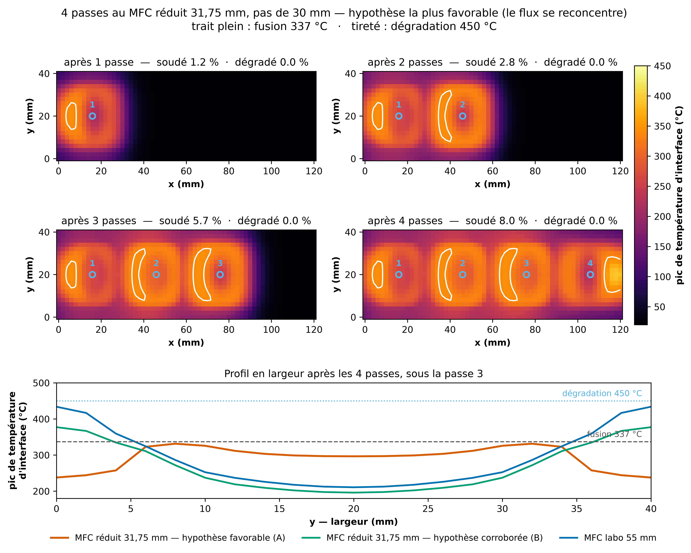
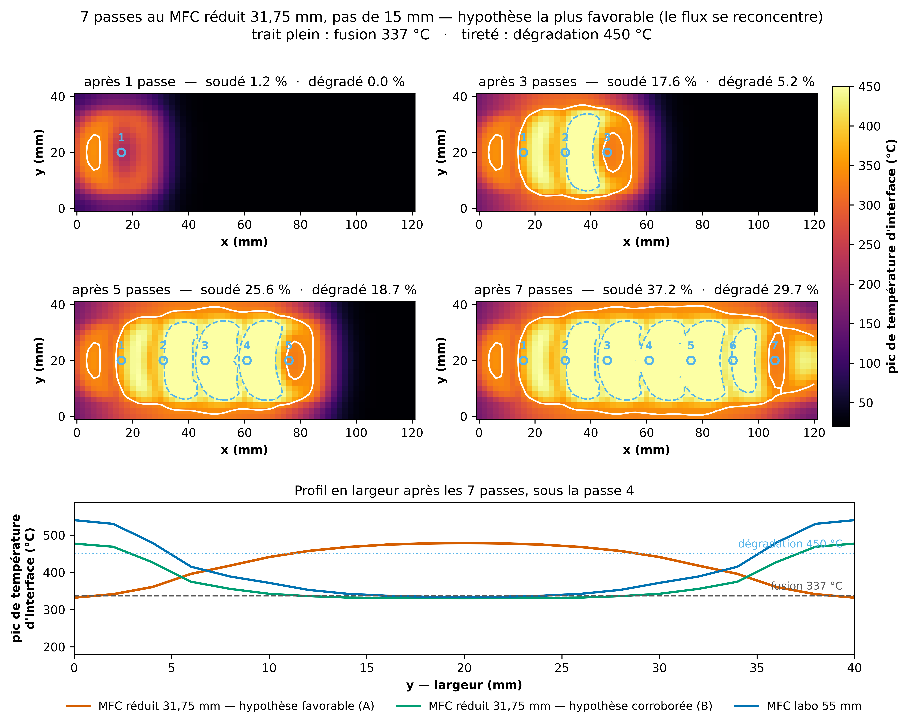

# Le verdict « pas de soudage uniforme » survit-il au changement d'hypothèse sur le MFC réduit ?

Généré le 2026-09-15. Plan de passes glouton puis vérification séquentielle (chaleur résiduelle incluse), seuils fusion 337 °C / dégradation 450 °C.

## Contrôle d'attribution

Avant toute comparaison, la configuration historique est rejouée : troncature dure, `h_bord_x0 = 250`, courants {200, 235} A.

| | publié (#31/#37/#39) | rejoué |
|---|---|---|
| soudé, plan glouton | 6.1 % | 6.1 % |
| soudé, séquentiel | 7.0 % | 7.0 % |

Deux choses séparent ce contrôle de la matrice qui suit : le θ* et la grille de courants. Les découpler évite d'attribuer à l'un ce qui vient de l'autre.

| grille de courants | h_bord_x0 | soudé, séquentiel |
|---|---|---|
| {200, 235} A | 250 (historique) | 7.0 % |
| {200, 235} A | 125 (canonique) | 7.0 % |

**Le θ* ne bouge rien ici**, et c'est attendu : `h_bord_x0` n'agit que sur le chant `x = 0`, alors que la couverture se joue sur les lobes du M, c'est-à-dire sur les chants en `y`. Tout l'écart avec la matrice ci-dessous vient donc de l'ajout de 250 A à la grille — la correction de θ* était nécessaire par cohérence, pas parce qu'elle changeait le verdict.

## Les quatre hypothèses, à θ* canonique

`h_bord_x0 = 125` (canonique depuis le 2026-09-06) et courants {200, 235, 250} A — la grille est ÉLARGIE vers le haut, donc le planificateur ne peut qu'y faire mieux.

| hypothèse sur le flux hors empreinte | soudé | dégradé | passes | MFC réduit retenu | uniforme |
|---|---|---|---|---|---|
| il disparaît (troncature dure) | 10.6 % | 0.0 % | 4 | non | NON |
| il se reconcentre (famille A) | 44.9 % | 33.4 % | 10 | oui | NON |
| il ne se reconcentre pas — obs. (famille B) | 10.6 % | 0.0 % | 4 | non | NON |
| il ne se reconcentre pas — source (famille B) | 10.6 % | 0.0 % | 4 | non | NON |

Trois des quatre panneaux de la figure sont identiques. Ce n'est pas une redondance de tracé : dans ces trois hypothèses le planificateur glouton **ne retient aucune passe au MFC réduit**, si bien que le plan se réduit aux mêmes passes au MFC labo 55 mm.

## Où se lit la physique : une passe unique

Une seule passe centrée en `x = 60 mm`, `y = 20 mm`, 235 A, 20 s. Le centre de la largeur est la **ligne nodale de la dissipation** (la puissance Joule y est nulle par symétrie) : il ne chauffe que par conduction latérale.

| hypothèse | pic (°C) | centre de la largeur (°C) |
|---|---|---|
| MFC labo 55 mm | 420.3 | 122.9 |
| tronquer | 168.4 | 115.1 |
| conserver | 331.3 | 228.8 |
| image_observation | 362.3 | 118.8 |
| image_source | 316.3 | 98.3 |

Aucune hypothèse n'amène le centre à la fusion (337 °C). La seule qui l'en rapproche est celle où le flux se reconcentre — et elle y parvient en portant les chants au-delà du seuil de dégradation.

## Les quatre passes du procédé, au MFC réduit

La séquence réelle — quatre dwells au pas de 30 mm (`x` = 15,9 / 45,9 / 75,9 /
105,9 mm), spot centré en largeur, 235 A, 20 s — jouée avec le MFC réduit dans
l'hypothèse **la plus favorable** des quatre (le flux se reconcentre, famille A).
C'est une **borne optimiste**, pas une prédiction : c'est précisément l'hypothèse
que les deux variantes de la famille B contredisent en s'accordant entre elles.

| après | soudé | dégradé | T max (°C) |
|---|---|---|---|
| 1 passe | 1,2 % | 0 % | 345,1 |
| 2 passes | 2,8 % | 0 % | 345,1 |
| 3 passes | 5,7 % | 0 % | 345,1 |
| 4 passes | 8,0 % | 0 % | 392,3 |

Pour comparaison, les mêmes quatre passes donnent **7,5 %** au MFC labo 55 mm et
**3,3 %** au MFC réduit sous l'hypothèse corroborée (famille B).

**Ce que la figure montre.** Le MFC réduit fait bien ce qu'on attendait de lui :
le profil en largeur **s'inverse**. Le M des chants disparaît, remplacé par un
plateau qui culmine à 330 °C vers `y` = 8 et 32 mm et retombe à 297 °C au centre.
La largeur entière passe donc dans une bande de 35 °C — mais **sous** le seuil de
fusion, qu'aucun point n'atteint. À 235 A, il manque une quarantaine de degrés
partout à la fois.

Les seules zones fondues sont les croissants entre passes : elles ne viennent pas
d'une passe mais du **recouvrement** de deux dwells successifs, c'est-à-dire de la
chaleur résiduelle. Ce qui soude dans cette séquence, ce n'est pas le
concentrateur, c'est l'accumulation.

## Et avec un pas plus serré ?

Même séquence, même étendue (premier et dernier centre inchangés), même courant
et même durée par passe — seul le pas change : **15 mm au lieu de 30**, donc
**7 passes au lieu de 4**. Attention, l'énergie déposée augmente d'autant : la
comparaison répond à « que donne un pas plus serré ? », pas à « à énergie
égale ».

| après | soudé | dégradé | T max (°C) |
|---|---|---|---|
| 1 passe | 1,2 % | 0 % | 345,1 |
| 3 passes | 17,6 % | 5,2 % | 524,5 |
| 5 passes | 25,6 % | 18,7 % | 554,8 |
| 7 passes | **37,2 %** | **29,7 %** | 559,2 |

**Le pas serré tient sa promesse — et révèle le vrai plafond.** La couverture
passe de 8,0 à 37,2 %, ce qui confirme que c'est bien le recouvrement qui soude.
Mais la contrainte a changé de camp : à 30 mm rien n'atteignait la fusion ; à
15 mm le centre *dépasse le seuil de dégradation* (478 °C) pendant que les chants
sont encore tout juste à la fusion (332 °C). Le profil en largeur s'est
complètement inversé — le M des chants est devenu un dôme central.

**Et le MFC réduit n'est alors plus le meilleur choix.** À pas égal, la même
séquence donne :

| configuration | soudé | dégradé |
|---|---|---|
| MFC réduit, hypothèse favorable (A) | 37,2 % | 29,7 % |
| MFC labo 55 mm | 37,3 % | 15,6 % |
| MFC réduit, hypothèse corroborée (B) | 34,5 % | **4,7 %** |

Le MFC réduit dans son hypothèse la plus favorable **ne soude pas plus** que le
MFC labo et **brûle deux fois plus** : en concentrant vers le centre, il empile
le recouvrement là où la chaleur s'évacue le moins. Sous l'hypothèse corroborée,
il soude un peu moins mais dégrade six fois moins.

Le levier « pas serré » ouvre donc une fenêtre, mais étroite : entre le moment où
les chants atteignent la fusion et celui où le centre dépasse la dégradation. Le
pas optimal, s'il existe, est entre 15 et 30 mm — non calculé ici.

## Ce que ce calcul ne prouve pas

- **Le taux de dégradation de la famille A est à prendre avec réserve.** Le seuil 450 °C est appliqué à une température d'interface calculée avec la config canonique, dont la chaleur latente vaut 130 J/g (valeur 100 % cristallin, ~3× trop) et qui n'a pas de plateau de fusion. Sur le cycle 231 A, cette config donne 865 °C là où le modèle de fusion donne 508 °C : au-delà du point de fusion, elle **surestime systématiquement** l'interface. Les 33 % dégradés sont donc un majorant, pas une mesure. Le verdict « non uniforme » ne repose pas dessus : 44.9 % de soudé n'est de toute façon pas une couverture.
- **Aucune des quatre hypothèses n'est de la physique établie.** Aucune ne résout le bloc de ferrite fini ; la méthode des images suppose un demi-espace infini. Elles encadrent un comportement, elles ne le calculent pas.
- **θ\* n'est recalibré pour aucune géométrie réduite** (objet de #60, après mesure).
- Le résidu structurel connu du jumeau — le centre se remplit trop lentement, indépendamment du courant — joue **dans le sens conservateur** ici : le modèle sous-estime le remplissage du centre. Une prédiction « le centre fond » serait donc robuste ; la prédiction « le centre ne fond pas » l'est moins, et c'est celle qu'on obtient.

Reproduire : `.venv/bin/python code/scripts/gen/gen_plan_passes_familles.py`
