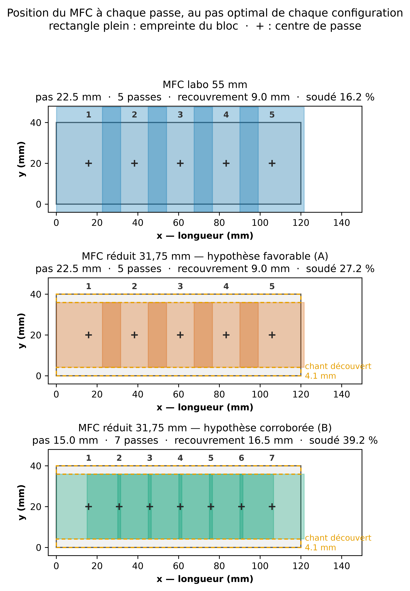

# Où se pose le MFC à chaque passe, au pas optimal

Généré le 2026-09-16. Pas optimaux repris de `balayage_pas_mfc_reduit.md` (le plus couvrant **sans aucune dégradation**, au critère de dose). Étendue fixe : premier centre `x` = 15.9 mm, dernier `x` = 105.9 mm, spot centré en largeur (`y` = 20 mm).

## Le point de géométrie qui explique tout le reste

L'empreinte du bloc vaut **31.5 mm le long de `x`** (le sens du déplacement) et 55 ou 31,75 mm **le long de `y`** (la largeur de la plaque) — cf. `geometrie.yaml:cfc`. Deux conséquences :

- **Le recouvrement entre passes ne dépend que du pas**, jamais de la taille du bloc : l'empreinte le long de `x` vaut 31.5 mm dans les deux cas.
- **Raccourcir le MFC agit en largeur.** Le bloc de 55 mm déborde la plaque de 7,5 mm de chaque côté ; le bloc réduit laisse **4,1 mm de chant découvert** de chaque côté. C'est la raison géométrique, visible directement, du verdict « le MFC réduit coupe les lobes de bord » (#39).

## Positions de passe (mm)

| configuration | pas | passes | recouvrement | centres `x` |
|---|---|---|---|---|
| MFC labo 55 mm | 22.5 mm | 5 | 9.0 mm | 15.9 · 38.4 · 60.9 · 83.4 · 105.9 |
| MFC réduit 31,75 mm — hypothèse favorable (A) | 22.5 mm | 5 | 9.0 mm | 15.9 · 38.4 · 60.9 · 83.4 · 105.9 |
| MFC réduit 31,75 mm — hypothèse corroborée (B) | 15.0 mm | 7 | 16.5 mm | 15.9 · 30.9 · 45.9 · 60.9 · 75.9 · 90.9 · 105.9 |

Les deux premières configurations partagent **les mêmes positions** : à pas égal, seule change l'emprise en largeur. La troisième resserre le pas, ce que le bloc réduit tolère sans dégrader là où le bloc de 55 mm ne le tolère plus.

Reproduire : `.venv/bin/python code/scripts/gen/gen_positions_passes_pas_optimal.py`
